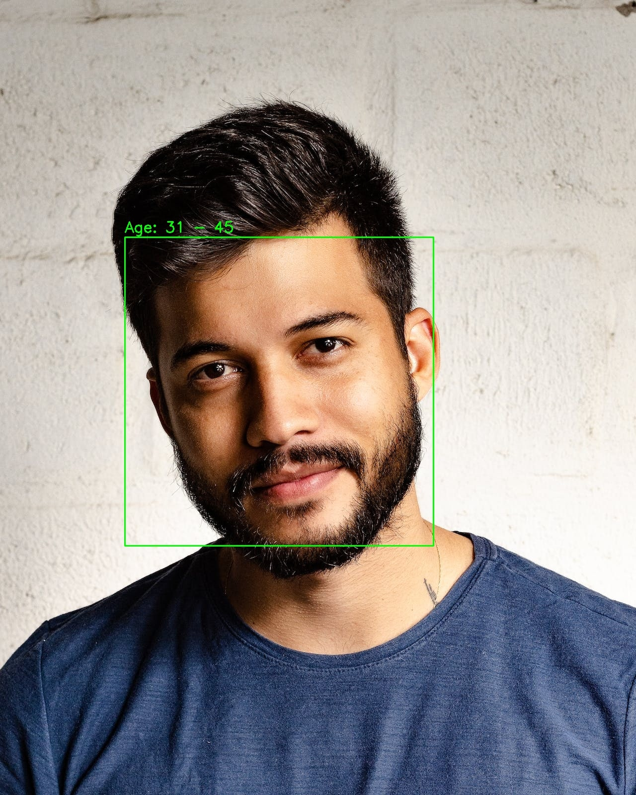

# Age Detection Using a Convolutional Neural Network

<p align='center'>

</p>

## Overview
This my study of Convolutional Neural Networks for multi-Class Classification. In this study, I developed a CNN model to predict the age ranges of individuals portrayed in images. 

To accomplish this, I utilized OpenCV for face detection within images, followed by employing my custom CNN model to predict the ages of detected faces. The application is deployed using Streamlit to provide a user-friendly interface for uploading images.

## Dataset
The dataset I used is [Age, Gender and Ethnicity (Face Data) CSV](https://www.kaggle.com/datasets/nipunarora8/age-gender-and-ethnicity-face-data-csv). It contains over 27000 images of faces that are classified based on Age, Gender and Ethnicity. For this project though, I was only interesed in the ages.

## Installation
To install the necessary dependencies, run the following command:

```
pip install -r requirements.txt
```

## Usage
To start the app, run the command below:
```
streamlit run main.py
```

This will open the app in your default web browser. From here you can upload the images you want to use for prediction.

## Model Results
This age detection model has a validation accuracy of around 65% with a loss of 0.81. This means that there is still need for improvements. Still, overall, the model is good as a learning example.


 
